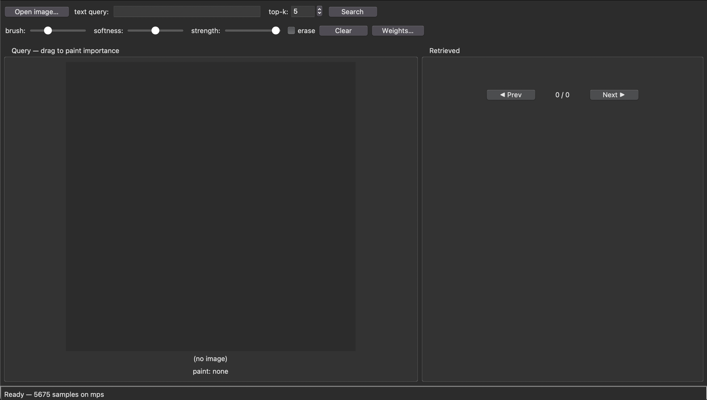
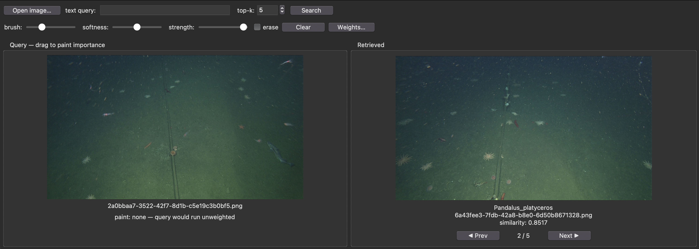
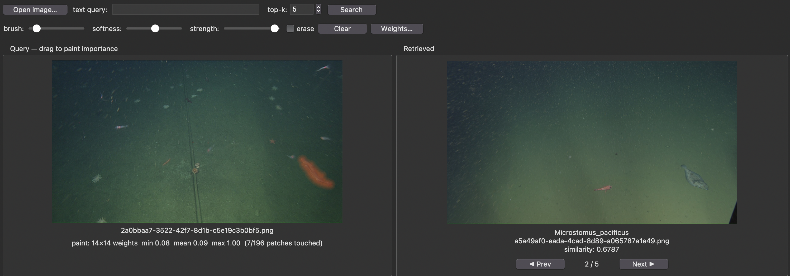

# deepsea-query
A queryable vector database for deep sea images

Search deep-sea ROV imagery using an image, a text description, or both. Images come from [FathomNet](https://fathomnet.org) (MBARI framegrabs). They are embedded with [BioCLIP](https://huggingface.co/imageomics/bioclip) and searched by cosine similarity. A small desktop GUI lets you paint over the parts of the query image that matter, which steers the search toward that region.

## Setup

Requires Python 3.10+.

```bash
pip install torch torchvision open_clip_torch fathomnet requests pillow numpy
```

The GUI uses `tkinter`, which ships with most Python installs. If you use Homebrew Python on macOS and `import tkinter` fails, run `brew install python-tk`.

The first time the model loads, BioCLIP (about 600 MB) is downloaded from the Hugging Face Hub and cached.

## 1. Download the data

`build_data.py` downloads MBARI framegrabs from FathomNet for each taxon listed in a config file.

```bash
python3 build_data.py --config taxa.json
```

### The config file

[taxa.json](taxa.json) maps group names to lists of FathomNet concept names:

```json
{
    "cephalopods": [
        "Vampyroteuthis infernalis",
        "Dosidicus gigas"
    ],
    "sponges": [
        "Farrea",
        "Staurocalyptus"
    ]
}
```

To download a different set of organisms, copy `taxa.json`, edit it, and pass your copy to `--config`. Concept names must match FathomNet's concept names exactly.

### Options

| Flag | Default | Description |
| --- | --- | --- |
| `--config PATH` | required | JSON file of `{group: [concept, ...]}` |
| `--per-taxon N` | 140 | Maximum images to download per concept |
| `--axis NAME` | all groups | Only build this group. Repeat to select several groups. |

```bash
# only download the sponges and ctenophores groups, 50 images each
python3 build_data.py --config taxa.json --axis sponges --axis ctenophores --per-taxon 50
```

### What it produces

```
dataset/
├── manifest.csv              # one row per image: concept, dive, depth, size, URL, ...
├── Atolla/
│   ├── <image-uuid>.png
│   └── ...
├── Vampyroteuthis_infernalis/
└── ...
```

To keep the images varied, frames are spread across as many dives as possible and no single dive supplies more than a quarter of a concept's images. Frames that also contain other taxa are picked first. Images that are already downloaded are reused, so rerunning the script is cheap. A partial run with `--axis` updates the manifest without dropping the other groups' rows.

### Using your own data

You don't have to use `build_data.py`. If you already have images, you can upload them or connect an external database instead. In that case, arrange the data in the same layout shown above: one folder per concept, with the images inside saved as `.png`. The folder name is used as the result's label in the GUI. `manifest.csv` is optional, since embedding and search only read the image folders.

The pipeline currently reads data only from the local disk, from a `dataset/` folder in the directory you run the scripts from. If your data is stored somewhere else, change the dataset path in these places:

| File | Setting |
| --- | --- |
| [embed_dataset.py](embed_dataset.py) | `DATASET_DIR` |
| [visualizer.py](visualizer.py) | `DATASET_DIR` |
| [build_data.py](build_data.py) | `OUT` (only if you also download with this script) |

Data in an external database or cloud storage isn't supported directly yet. You'll need to either sync it to a local folder first or change the loading code in `embed_dataset.py` and `load_vectors()` in `visualizer.py` so it reads from your storage.

## 2. Embed the data

Compute a BioCLIP vector for every downloaded image:

```bash
python3 embed_dataset.py
```

Each `dataset/<concept>/<uuid>.png` gets a matching `<uuid>.pt` vector next to it. Images that already have a vector are skipped, so after downloading more data you only pay for the new images. The script uses Apple `mps`, then `cuda`, then `cpu`, whichever is available first.

### Preprocessing mode

[preprocess.py](preprocess.py) has a `MODE` setting:

- **`pad`** (default): letterboxes the whole frame to a square, so organisms near the edge of the frame stay in view.
- **`crop`**: open_clip's standard center crop, which cuts off roughly the outer 22% of a 16:9 frame.

The dataset and the queries must use the same mode. The mode used is recorded in `dataset/.embed_mode`. If you change `MODE`, the next `embed_dataset.py` run recomputes every vector automatically.

## 3. Search with the GUI

```bash
python3 visualizer.py
```

The status bar reads **Loading model…** while BioCLIP and the dataset vectors load. It changes to **Ready — N samples on <device>** when you can start searching.

<!-- SCREENSHOT: the full window right after launch, showing the "Ready" status bar -->


### Run a query

1. Click **Open image…** and choose a query image (PNG, JPG, BMP, or WebP).
2. You can also type a description in **text query**, for example `a red jellyfish`. You can search with text only, an image only, or both. When you give both, their embeddings are averaged.
3. Set **top-k** to the number of results you want back.
4. Click **Search** or press Enter in the text box.

<!-- SCREENSHOT: a query image loaded on the left with a text query typed in -->


### Paint to focus the search

Drag on the query image to paint the regions you care about, such as one animal in a busy frame. Painted areas show an orange tint. When anything is painted, the model's attention is biased toward those patches, so the search matches the painted subject rather than the whole scene. With nothing painted, the whole image is weighted equally.

| Control | What it does |
| --- | --- |
| **brush** | Brush radius |
| **softness** | Edge falloff. 0 is a hard edge; higher values are more feathered. |
| **strength** | Maximum weight a stroke can add |
| **erase** | Paint removes weight instead of adding it |
| **Clear** | Removes all paint |
| **Weights…** | Shows the 14×14 patch weight grid the model will receive |

The line under the image summarizes the current weights, including how many of the 196 patches you have touched. In `crop` mode, the area the model never sees is darkened and outlined, and you get a warning if paint falls outside it.



### Browse results

Results are shown on the right in order of similarity. Each result shows its concept folder, file name, and cosine similarity score. Step through them with **◀ Prev** / **Next ▶** or the left and right arrow keys.

## Project layout

| File | Purpose |
| --- | --- |
| [build_data.py](build_data.py) | Download FathomNet images listed in a taxa config |
| [taxa.json](taxa.json) | Default taxa config |
| [embed_dataset.py](embed_dataset.py) | Embed every dataset image to a `.pt` vector |
| [preprocess.py](preprocess.py) | Shared pad/crop preprocessing for the dataset and queries |
| [embedder.py](embedder.py) | BioCLIP wrapper, including attention biasing from painted weights |
| [query.py](query.py) | Cosine-similarity search over the stored vectors |
| [visualizer.py](visualizer.py) | tkinter GUI |
| [data_types.py](data_types.py) | `vector` container (embedding + image path) |
